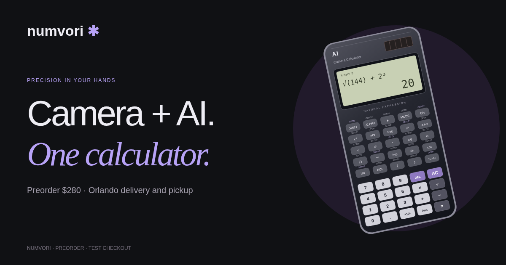

# Numvori

**A bilingual AI camera calculator preorder storefront with interactive 3D visuals, online tools, and a test checkout.**

[Live website](https://numvori.com/) · [Buying guides](https://numvori.com/guides/) · [Development guide](docs/DEVELOPMENT.md)



## About the project

I created Numvori as a personal portfolio project to explore how product design, interactive graphics, and web development come together in an online store. The idea started with online calculators and grew into a storefront for physical scientific calculators, with English and Russian content. The current storefront focuses on one supplier-made AI camera calculator, offered for preorder at $280 with planned delivery and pickup in Orlando.

My focus was on the complete visitor experience: discovering a calculator, comparing models, reading a buying guide, managing a shopping bag, and trying a sandbox purchase. I also connected a custom domain, configured authentication, and submitted the site to Google Search Console.

**Author:** [XXXVAMANE](https://github.com/XXXVAMANE)

## Features

- **Bilingual storefront:** English and Russian routes with a language switch that preserves the current page.
- **Product discovery:** one AI camera calculator preorder page, reference pages for conventional models, and three buying guides.
- **Interactive presentation:** a Three.js calculator scene with pointer and keyboard rotation, SVG fallbacks, and reduced-motion support.
- **Shopping bag:** quantities, removal, totals, and persistence across page visits and languages.
- **Stripe sandbox checkout:** hosted USD card payments with US test shipping addresses and server-verified results.
- **Email accounts:** Supabase sign-up, confirmation, sign-in, sign-out, and password recovery.
- **Online tools:** scientific calculations, finance estimates, percentages, and unit conversions without an account.
- **Optional AI explanations:** a server-side OpenAI integration requested explicitly by the visitor.
- **SEO foundations:** static HTML, canonical URLs, language alternates, structured data, a sitemap, and social sharing metadata.

## Design and technical decisions

| Decision | Purpose |
| --- | --- |
| Astro with static pages | Make product and guide content available without waiting for client-side rendering. |
| TypeScript browser modules | Add cart, calculator, and account interactions without a full client-side application framework. |
| Locally hosted fonts and graphics | Keep the presentation self-contained and avoid runtime asset CDN dependencies. |
| Progressive 3D enhancement | Load the scene near the viewport, pause it when hidden, and retain a usable fallback. |
| Server-owned checkout prices | Validate products and quantities against the catalog instead of trusting browser totals. |
| Verified checkout completion | Clear the matching cart only after Stripe confirms a completed, paid test session. |
| Shared production origin | Keep generated SEO URLs and checkout redirects consistent on the custom domain. |

## Technology stack

| Area | Technologies |
| --- | --- |
| Pages and styling | Astro 5, TypeScript, CSS, Manrope, Lora |
| Interactive graphics | Three.js, WebGL, SVG |
| Backend | Node.js, Netlify Functions |
| Integrations | Supabase Auth, Stripe Checkout in test mode, OpenAI API |
| Verification | Node.js test runner, Playwright, Astro Check |
| Hosting | Netlify with GitHub deployments and a custom HTTPS domain |

## Run locally

Use **Node.js 24** and npm. Clone the repository:

```sh
git clone https://github.com/XXXVAMANE/Numvori.git
cd Numvori
```

### Windows — PowerShell

```powershell
npm.cmd ci
$env:ASTRO_TELEMETRY_DISABLED = "1"
npx.cmd astro dev
```

`npm.cmd` avoids PowerShell's `npm.ps1` execution-policy restriction. Invoking Astro directly also avoids the Unix-style environment assignment in the existing npm scripts.

### macOS / Linux

```sh
npm ci
npm run dev
```

Open the local address printed in the terminal (default port **4321**). Saving source files refreshes the development view. Stop the server with **Ctrl + C**.

Browsing, cart interactions, and numeric calculators work without provider credentials. Authentication needs Supabase configuration; AI explanations and checkout additionally need the server endpoints. See the [development guide](docs/DEVELOPMENT.md) for optional integrations and a production-style local server.

## Project structure

```text
src/
  components/      Storefront, device illustrations, guides, accounts, tools
  data/            Bilingual copy, product descriptions, guide content
  pages/           English/Russian routes, sitemap, robots
  scripts/         Cart, authentication, math, checkout, 3D interactions
  styles/          Layout, store theme, motion, editorial styling
lib/               Shared catalog, site origin, checkout and AI handlers
netlify/functions/ Serverless API entry points
public/            Static assets, sharing image, search verification file
tests/             Unit, API, and browser tests
docs/              Development and deployment instructions
```

Netlify publishes the generated `dist/` directory. The older `ready-site/` export is not the active deployment source.

## Verification

Existing tests cover calculations, checkout validation, bilingual navigation, cart persistence, account flows, guides, SEO metadata, and 3D fallbacks. Provider requests in automated tests are mocked; browser tests do not send real payments or emails.

On macOS / Linux:

```sh
npm run check
npm test
npm run build
npm run test:ui
```

Windows commands and the mocked account test configuration are documented in the [development guide](docs/DEVELOPMENT.md).

## Project status

The current product is a **$280 preorder** for an AI calculator with a rear camera and built-in display. Numvori resells this supplier-made device; it is not the manufacturer. Delivery and pickup in Orlando are planned, with arrival date, fees and pickup location still to be confirmed. The published checkout remains a test preview: no real charge, stock reservation, or actual preorder is submitted. Real taxes/shipping, webhook fulfillment and order tracking are not implemented.

Casio and Texas Instruments pages remain as reference material for existing guides and are excluded from the sale catalog and sitemap. The AI device visuals and walkthrough are labelled illustrations, not supplier photographs or live device output. Camera resolution, supported AI providers, connectivity and power specifications await supplier verification. The optional OpenAI website service is separate from the hardware.

## Next steps

- Make the npm scripts work directly across Windows, macOS, and Linux.
- Improve accessibility and performance through continued browser testing.
- Add durable order records and webhook handling if the project grows beyond a demo.
- Replace sample catalog data with verified stock, prices, and fulfillment terms before enabling real sales.

## По-русски

Numvori — мой проект для портфолио: двуязычная витрина научных калькуляторов с 3D-презентацией, корзиной, учебными инструментами, аккаунтами и тестовой оплатой. Я развивал идею от онлайн-калькуляторов до магазина с отдельными страницами моделей и статьями, подключил собственный домен и настроил публикацию через GitHub и Netlify. Сейчас витрина предлагает один ИИ-калькулятор с камерой по предзаказу за $280, с планируемой доставкой и самовывозом в Орландо. Numvori перепродаёт устройство поставщика. Оплата пока тестовая и не оформляет реальный предзаказ.
